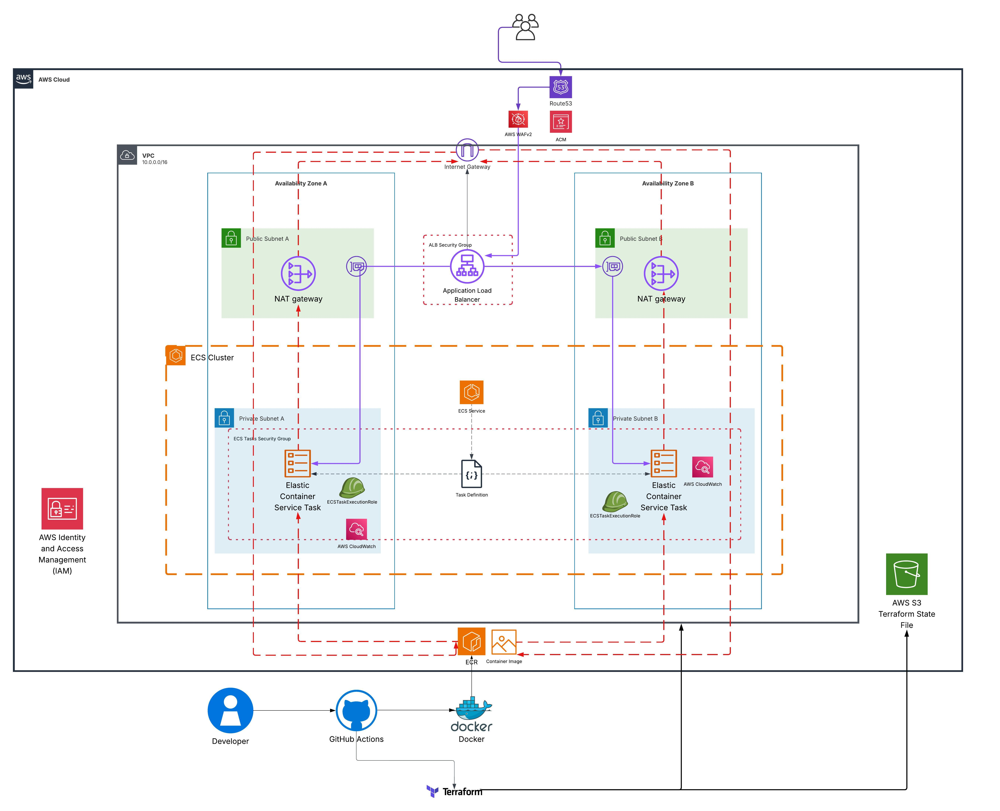

# Shiori on AWS ECS Fargate

## Overview
This project deploys [Shiori](https://github.com/go-shiori/shiori) on AWS ECS Fargate using a highly available architecture across two availability zones.

Shiori is a bookmark manager written in Go that provides bookmark management in a simple and easy to use web interface.

## Project Structure

```text

.
├── app/
├── README.md
└── terraform
    ├── modules
        ├── acm
           ├── main.tf
           ├── outputs.tf
           ├── variables.tf
        ├── alb
           ├── main.tf
           ├── outputs.tf
           ├── variables.tf
        ├── ecr
           ├── main.tf
           ├── outputs.tf
           ├── variables.tf
        ├── ecs
           ├── main.tf
           ├── outputs.tf
           ├── variables.tf
        ├── iam
           ├── main.tf
           ├── outputs.tf
           ├── variables.tf
        ├── route53
           ├── main.tf
           ├── outputs.tf
           ├── variables.tf
        ├── routes
           ├── main.tf
           ├── outputs.tf
           ├── variables.tf
        ├── sg
           ├── main.tf
           ├── outputs.tf
           ├── variables.tf
        ├── vpc
           ├── main.tf
           ├── outputs.tf
           ├── variables.tf
    ├── backend.tf
    ├── main.tf
    ├── outputs.tf
    ├── provider.tf
    ├── terraform.tfvars
    └── variables.tf
## Architecture Diagram
The diagram below illustrates the architecture of this deployment.  



## Architecture
- **ECS Fargate** cluster with tasks running in private subnets.  
- **Public subnets** host the Application Load Balancer and NAT Gateways.  
- **NAT Gateway** provides outbound internet access for ECS tasks to pull images from Amazon ECR and communicate with external services.  
- **Application Load Balancer (ALB)** terminates TLS and routes traffic to ECS tasks. HTTP requests are redirected to HTTPS.  
- **Amazon Route 53** manages DNS records for custom domain ridwanprojects.com.  
- **AWS Certificate Manager (ACM)** provides SSL/TLS certificates with automated validation.  
- **CloudWatch** collects and stores ECS task logs for observability.  

### Architecture Features

| Feature                                | Description                                                                                  |
|----------------------------------------|----------------------------------------------------------------------------------------------|
| **High Availability**                  | ECS Fargate tasks deployed across two availability zones for resilience and fault tolerance. |
| **Private Networking**                  | Tasks run in private subnets with outbound internet access via NAT Gateway.                  |
| **Load Balancing**                      | Application Load Balancer with HTTP → HTTPS redirection and TLS termination.                 |
| **Web Application Firewall (WAFv2)**    | AWS Managed Core Rule Set protects against SQL injection, XSS, HTTP floods, and probes.      |
| **Infrastructure as Code**              | Modularised Terraform setup with DRY principles and remote backend for state management.     |
| **CI/CD Integration**                   | GitHub Actions pipelines for build, scan, and deployment with Checkov and Trivy.             |
| **Logging and Monitoring**              | ECS task logs captured in CloudWatch for troubleshooting and observability.                  |
| **DNS and Certificates**                | Route 53 for custom domain and ACM with automated certificate validation.                    |
| **Security Best Practices**             | Security groups restrict traffic flow; IAM roles use least privilege policies.               |

## Security
- **Security groups** enforce least privilege:
  - ALB allows inbound HTTP/HTTPS traffic from the internet.
  - ECS tasks accept traffic only on the application port from the ALB security group.  
- **WAFv2** is deployed with AWS Managed Core Rule Set to mitigate:
  - SQL injection  
  - Cross-site scripting  
  - HTTP flood attacks  
  - Scanning probes and other common threats  
- **IAM roles** follow the principle of least privilege:
  - ECS task execution role allows pulling images from ECR and sending logs to CloudWatch.

## Infrastructure as Code
- **Terraform** provisions AWS resources.  
- Modularised design follows DRY principles for maintainability and reusability.  
- Remote backend uses S3 for state storage with the new native state locking feature (no DynamoDB required).  
- Terraform import used to import ECR repository and hosted zone resources

## CI/CD
- **GitHub Actions** automates build, security scanning, and deployment.  
- **Docker** builds container images and pushes them to Amazon ECR.  
- **Checkov** scans Terraform configurations for misconfigurations.  
- **Trivy** scans container images for vulnerabilities.  
- Pipelines ensure that only secure and compliant builds are deployed.  

## Deployment Steps
1. Clone the repository.  
2. Configure AWS credentials with appropriate IAM permissions.  
3. Build and push Shiori Docker image to ECR using GitHub Actions pipeline.  
4. Run Terraform to provision networking, ECS, ALB, Route 53, ACM, WAF, and supporting resources.  
5. ECS Service deploys the Shiori containers in private subnets.  
6. Access Shiori securely through the Route 53 domain with HTTPS enabled.  

## Monitoring
- ECS task logs are available in CloudWatch.  
